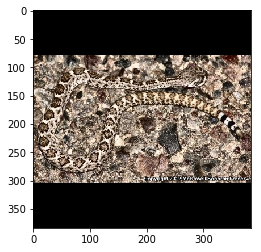

<br><br><br>
<font size=9>**基于飞桨开发的《野外蛇谱》**</font>
<br><br><br>

<font size=6>**项目来源**</font>
<br><br>
&emsp;&emsp;&emsp;&emsp;<font size=5>我们知道毒蛇伤人事件在全世界范围内已造成相当一部分的死亡和受伤案例，这对于公众健康是一个重要的却又容易被忽视的影响因素。一部分人被蛇咬后无法准确地区分蛇的种类，无法知道蛇有毒与否，并且还因为不具备一定的自救知识而被蛇咬后不知所措。基于此，本项目基于飞桨开发了一款《野外蛇谱》的app，帮助人们在野外被蛇咬后准确识别蛇的种类，并精准判断蛇的毒性，提供自救方案，帮助人们在被蛇咬后的紧急处理。</font>
<br><br><br>

<font size=6>**项目效果**</font>
<br><br>
&emsp;&emsp;&emsp;<font size=5>app在判断蛇无毒情况下的反应</font>
&emsp;&emsp;&emsp;&emsp;&emsp;&emsp;&emsp;&emsp;&emsp;&emsp;<font size=5>app在判断蛇有毒情况下的反应</font>
<br><br>

&emsp;&emsp;&emsp;&emsp;&emsp;
<br><br><br>

<font size=6>**演示视频**</font>
<br><br>
&emsp;&emsp;&emsp;&emsp;<font size=5>b站：[https://www.bilibili.com/video/BV1Zp4y1i7ug](http://)</font>
<br><br><br>

<font size=6>**实现方式：基于飞桨的ResNet50_vd_ssld模型**</font>
<br><br><br>
&emsp;&emsp;&emsp;&emsp;<font size=5>ResNet50_vd_ssld实现原理请移步到至官方介绍学习：</font><font size=5>[介绍](https://blog.csdn.net/weixin_45449540/article/details/106798605?ops_request_misc=%257B%2522request%255Fid%2522%253A%2522159512766219195239841908%2522%252C%2522scm%2522%253A%252220140713.130102334..%2522%257D&request_id=159512766219195239841908&biz_id=0&utm_medium=distribute.pc_search_result.none-task-blog-2~all~first_rank_ecpm_v3~pc_rank_v2-1-106798605.first_rank_ecpm_v3_pc_rank_v2&utm_term=ResNet50_vd_ssld)</font>
<br><br><br>

<font size=6>**项目目录**</font>
<br><br>
&emsp;&emsp;&emsp;&emsp;<font size=5>1.安装PaddleX、Paddle-Lite</font>
<br><br>
&emsp;&emsp;&emsp;&emsp;<font size=5>2.处理数据集</font>
<br><br>
&emsp;&emsp;&emsp;&emsp;<font size=5>3.开始模型的训练</font>
<br><br>
&emsp;&emsp;&emsp;&emsp;<font size=5>4.查看模型预测效果</font>
<br><br>
&emsp;&emsp;&emsp;&emsp;<font size=5>5.部署到移动端上</font>
<br><br>
&emsp;&emsp;&emsp;&emsp;<font size=5>6.根据个人需求修改官方在移动端的部署demo</font>
<br><br><br><br>

<font size=5>**1.安装PaddleX、Paddle-Lite**</font>


```python
!pip install paddlex
!pip install paddlelite
```

<br><br><br>
<font size=5>**2.处理数据集**</font>
<br><br>

&emsp;&emsp;&emsp;&emsp;<font size=4>**2.1.解压数据集**</font>


```python
!unzip data/data44587/snake_data.zip -d /home/aistudio/
```

&emsp;&emsp;&emsp;&emsp;<font size=4>**2.2.制造val_list.txt，train_list.txt**</font>
<br><br>
&emsp;&emsp;&emsp;&emsp;&emsp;&emsp;&emsp;&emsp;<font size=4>详情请查看官方文档：[文档](https://gitee.com/paddlepaddle/PaddleX/tree/develop)</font>

<br><br><br>
<font size=5>**3.开始模型的训练**</font>
<br><br>

&emsp;&emsp;&emsp;&emsp;<font size=4>**3.1.设置使用0号GPU卡**</font>


```python
import matplotlib
matplotlib.use('Agg') 
import os
os.environ['CUDA_VISIBLE_DEVICES'] = '0'
import paddlex as pdx
```

&emsp;&emsp;&emsp;&emsp;<font size=4>**3.2.图像预处理+数据增强**</font>


```python
from paddlex.cls import transforms
train_transforms = transforms.Compose([
    transforms.RandomCrop(crop_size=224),
    transforms.RandomHorizontalFlip(),
    transforms.Normalize()
])
eval_transforms = transforms.Compose([
    transforms.ResizeByShort(short_size=256),
    transforms.CenterCrop(crop_size=224),
    transforms.Normalize()
])
```

&emsp;&emsp;&emsp;&emsp;<font size=4>**3.3.数据迭代器的定义**</font>


```python
train_dataset = pdx.datasets.ImageNet(
    data_dir='snake_data',
    file_list='snake_data/train_list.txt',
    label_list='snake_data/labels.txt',
    transforms=train_transforms,
    shuffle=True)
eval_dataset = pdx.datasets.ImageNet(
    data_dir='snake_data',
    file_list='snake_data/val_list.txt',
    label_list='snake_data/labels.txt',
    transforms=eval_transforms)
```

    2020-07-19 11:49:17 [INFO]	Starting to read file list from dataset...
    2020-07-19 11:49:17 [INFO]	17364 samples in file snake_data/train_list.txt
    2020-07-19 11:49:17 [INFO]	Starting to read file list from dataset...
    2020-07-19 11:49:17 [INFO]	25 samples in file snake_data/val_list.txt


&emsp;&emsp;&emsp;&emsp;<font size=4>**3.4.开始炼丹**</font>


```python
num_classes = len(train_dataset.labels)
model = pdx.cls.ResNet50_vd_ssld(num_classes=num_classes)
model.train(num_epochs = 60,
            save_interval_epochs = 10,
            train_dataset = train_dataset,
            train_batch_size = 64,
            eval_dataset = eval_dataset,
            learning_rate = 0.025,
            warmup_steps = 1084,
            warmup_start_lr = 0.0001,
            lr_decay_epochs=[20, 40],
            lr_decay_gamma = 0.025,    
            save_dir='/home/aistudio',
            use_vdl=True)
```

<font size=5>**4.查看模型预测效果**</font>
<br><br>


```python
import cv2
import matplotlib.pyplot as plt

# 加载模型
print('**************************************加载模型*****************************************')
model = pdx.load_model('best_model')

# 显示图片
img = cv2.imread('test.jpg')
b,g,r = cv2.split(img)
img = cv2.merge([r,g,b])
%matplotlib inline
plt.imshow(img)

# 预测
result = model.predict('test.jpg', topk=3)
print('**************************************预测*****************************************')
print(result[0])
```

    **************************************加载模型*****************************************
    2020-07-19 14:21:06 [INFO]	Model[ResNet50_vd_ssld] loaded.
    **************************************预测*****************************************
    {'category_id': 4, 'category': '西部菱斑响尾蛇', 'score': 0.9999999}





<font size=5>**5.部署到移动端上**</font>
<br><br>

&emsp;&emsp;&emsp;&emsp;<font size=4>**5.1.用PaddleX导出inference模型**</font>
<br><br>
| 参数 | 说明 |
| -------- | -------- |  
| --model_dir     | inference模型所在的文件地址，文件包括：`.pdparams`、`.pdopt`、`.pdmodel`、`.json`和`.yml`   |
| --save_dir     | 导出inference模型，文件将包括：`__model__`、`__params__`和`model.yml`   |


```python
!paddlex --export_inference --model_dir=best_model --save_dir=./inference_model/ResNet50_vd_ssld
```

    W0717 23:24:19.157521 13809 device_context.cc:252] Please NOTE: device: 0, CUDA Capability: 70, Driver API Version: 9.2, Runtime API Version: 9.0
    W0717 23:24:19.161340 13809 device_context.cc:260] device: 0, cuDNN Version: 7.3.
    2020-07-17 23:24:22 [INFO]	Model[ResNet50_vd_ssld] loaded.
    2020-07-17 23:24:22 [INFO]	Model for inference deploy saved in ./inference_model/ResNet50_vd_ssld.


&emsp;&emsp;&emsp;&emsp;<font size=4>**5.2.查看模型能否被部署到移动端**</font>


```python
# 如果需要部署到arm架构上，请执行此条命令
!paddle_lite_opt --print_model_ops=true  --model_dir=inference_model/ResNet50_vd_ssld --valid_targets=arm
```

    OPs in the input model include:
                                            OP_name      Host       X86      CUDA       ARM    OpenCL      FPGA       NPU       XPU     RKNPU       APU       Any       Unk
                                         batch_norm                   Y                   Y                                                                                
                                             conv2d                   Y         Y         Y         Y         Y                                                            
                                    elementwise_add                   Y         Y         Y         Y         Y                                                            
                                               feed         Y                   Y                             Y                                                            
                                              fetch         Y                                                 Y                                                            
                                                mul                   Y         Y         Y                                                                                
                                             pool2d                   Y         Y         Y         Y         Y                                                            
                                               relu                   Y         Y         Y         Y                                                                      
                                              scale                   Y         Y         Y         Y         Y                                                            
                                            softmax                   Y         Y         Y                                                                                
    Paddle-Lite supports this model!


```python
# 如果需要部署到华为NPU上，请执行此条命令
!paddle_lite_opt --print_model_ops=true  --model_dir=inference_model/ResNet50_vd_ssld --valid_targets=npu,arm
```

    OPs in the input model include:
                                            OP_name      Host       X86      CUDA       ARM    OpenCL      FPGA       NPU       XPU     RKNPU       APU       Any       Unk
                                         batch_norm                   Y                   Y                                                                                
                                             conv2d                   Y         Y         Y         Y         Y                                                            
                                    elementwise_add                   Y         Y         Y         Y         Y                                                            
                                               feed         Y                   Y                             Y                                                            
                                              fetch         Y                                                 Y                                                            
                                                mul                   Y         Y         Y                                                                                
                                             pool2d                   Y         Y         Y         Y         Y                                                            
                                               relu                   Y         Y         Y         Y                                                                      
                                              scale                   Y         Y         Y         Y         Y                                                            
                                            softmax                   Y         Y         Y                                                                                
    Paddle-Lite supports this model!


&emsp;&emsp;&emsp;&emsp;<font size=4>**5.3.转化成Paddle-Lite**</font>


```python
# 如果需要部署到arm架构上，请执行此条命令
!paddle_lite_opt \
    --model_file=inference_model/ResNet50_vd_ssld/__model__ \
    --param_file=inference_model/ResNet50_vd_ssld/__params__ \
    --optimize_out_type=naive_buffer \
    --optimize_out=mobile_cpu_model \
    --valid_targets=arm
```


```python
# 如果需要部署到华为NPU上，请执行此条命令
!paddle_lite_opt \
    --model_file=inference_model/ResNet50_vd_ssld/__model__ \
    --param_file=inference_model/ResNet50_vd_ssld/__params__ \
    --optimize_out_type=naive_buffer \
    --optimize_out=mobile_npu_model \
    --valid_targets=arm,npu
```

&emsp;&emsp;&emsp;&emsp;<font size=4>**5.4.部署到手机上**</font>

<br>
&emsp;&emsp;&emsp;&emsp;<font size=4>说明：作者在windows下进行演示</font>
<br><br><br>

&emsp;&emsp;&emsp;&emsp;&emsp;&emsp;&emsp;&emsp;<font size=3>**5.4.1.在windows安装并配置好Android Studio**</font>
<br><br>
&emsp;&emsp;&emsp;&emsp;&emsp;&emsp;&emsp;&emsp;[<font size=4>Android Studio安装指南</font>](https://jingyan.baidu.com/article/3d69c55150e181f0cf02d70c.html)

<br><br>
&emsp;&emsp;&emsp;&emsp;&emsp;&emsp;&emsp;&emsp;<font size=3>**5.4.2.下载官方Paddle-Lite-Demo项目**</font>
<br><br>
&emsp;&emsp;&emsp;&emsp;&emsp;&emsp;&emsp;&emsp;[<font size=4>官方demo</font>](https://gitee.com/paddlepaddle/Paddle-Lite-Demo.git)

<br><br>
&emsp;&emsp;&emsp;&emsp;&emsp;&emsp;&emsp;&emsp;<font size=3>**5.4.3.在Android Studio导入项目**</font>
<br>

&emsp;&emsp;&emsp;&emsp;&emsp;&emsp;&emsp;&emsp;

<br><br>
&emsp;&emsp;&emsp;&emsp;&emsp;&emsp;&emsp;&emsp;<font size=3>**5.4.4.对官方demo中一些文件进行修改**</font>
<br><br>
&emsp;&emsp;&emsp;&emsp;&emsp;&emsp;&emsp;&emsp;<font size=3>①将demo中labels目录下的.txt替换成自己的labels.txt</font>
<br>
&emsp;&emsp;&emsp;&emsp;&emsp;&emsp;&emsp;&emsp;
<br><br>
&emsp;&emsp;&emsp;&emsp;&emsp;&emsp;&emsp;&emsp;<font size=3>②在demo中models目录下创建一个文件夹(作者将它命名为snake)</font>
<br>
&emsp;&emsp;&emsp;&emsp;&emsp;&emsp;&emsp;&emsp;
<br><br>
&emsp;&emsp;&emsp;&emsp;&emsp;&emsp;&emsp;&emsp;<font size=3>③snake文件夹中放入经Paddle-Lite转化得到的.nb文件</font>
<br>
&emsp;&emsp;&emsp;&emsp;&emsp;&emsp;&emsp;&emsp;
<br><br>
&emsp;&emsp;&emsp;&emsp;&emsp;&emsp;&emsp;&emsp;<font size=3>④根据以上设定修改string.xml的配置</font>
<br>
&emsp;&emsp;&emsp;&emsp;&emsp;&emsp;&emsp;&emsp;

<br><br>
&emsp;&emsp;&emsp;&emsp;&emsp;&emsp;&emsp;&emsp;<font size=3>**5.4.5.将手机设置为开发者模式**</font>
<br>

<br><br>
&emsp;&emsp;&emsp;&emsp;&emsp;&emsp;&emsp;&emsp;<font size=3>**5.4.6.在Android Studio上将项目部署到手机上**</font>
<br>

&emsp;&emsp;&emsp;&emsp;&emsp;&emsp;&emsp;&emsp;

<br><br>
&emsp;&emsp;&emsp;&emsp;&emsp;&emsp;&emsp;&emsp;<font size=3>**5.4.7.将官方的demo进行优化，使得UI界面更为好看，实现遇到剧毒蛇后提供急救方法的功能**</font>
<br><br><br>
&emsp;&emsp;&emsp;&emsp;&emsp;&emsp;&emsp;
&emsp;<font size=3>**-->>**</font>
&emsp;
<br><br>
&emsp;&emsp;&emsp;&emsp;&emsp;&emsp;&emsp;
&emsp;<font size=3>**-->>**</font>
&emsp;

<br><br>
<font size=5>**写在最后**</font>
<br><br>
&emsp;&emsp;<font size=4.5>本项目欢迎有大量蛇的种类的数据集的人员进行二创。</font>

<br><br><br>
